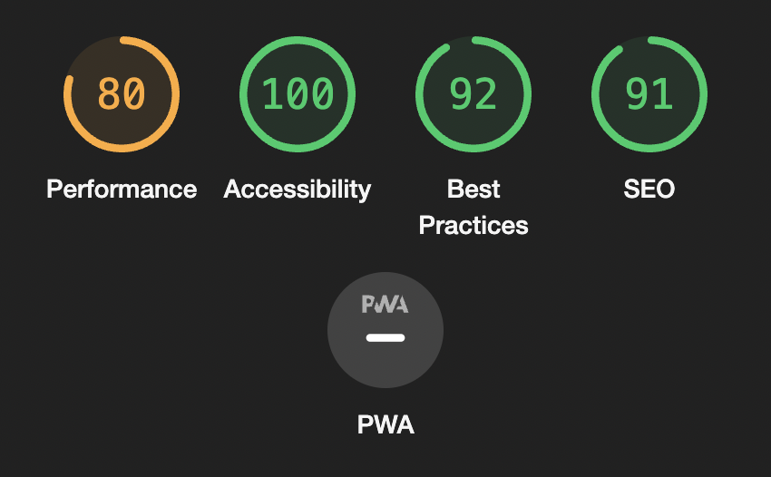

# Tic Tac Toe

Tic Tac Toe is a web-based version of the classic tic tac toe game that aims to provide a more immersive experience than the regular board game. The site will be useful for people by providing a far more portable alternative to the original game.

## Features 

### Existing Features

- __Game Heading__

  - Always visible on the page, the game heading acts as a informative heading displaying relevant information to the gameplay.
  - This section allows the user to easily see who's turn it is in the game, the result of the end game aswell as easily see what the site is about, by displaying "Tic Tac Toe" when no gameplay relevant info is needed.

- __Game Rules__

  - The landing page includes a section explaining the game rules in an easy-to-read list format.
  - This section introduces the user to the game and thoroughly explains it's rules.
  - This section is always accessible to the user even when the game has begun.
  - When this section is accessed during the game, the game state is not lost.

- __Reload Page Button__

  - This button allows the user to reload the page at any stage.
  - Provides the user an easy way to reload the entire page and reset all values

- __Game Grid__ 

  - The game grid is the main attraction of the site. It is fully responsive and every cell is clickable.
  - The game grid provides the user a way to play tic tac toe in a web environment.

- __Score Indicators__

  - The score indicators displays the score of each player. It styles appropriately to who is in the lead.
  - The score indicators provide an easy way for the user to see their current score.

- __Rematch and Game Rules Buttons__

  - Rematch button:
    - Resets the grid and starts a new round
    - Provides the user a way to continue playing the game after the round has ended.

  - Game Rules button(?)
    - Displays the game rules section
    - Provides the user a way to read the game rules again without having to reload the page.

- __Settings section and buttons__

  - Controls the settings of the game.
  - Provides users a way to control and fine-tune their gameplay.

  - 2 Player button:
    - Allows 2 users to take turns placing markers in the grid.
    - Provides the user with a way to play with their friends.

  - VS Computer button
    - Allows user to play vs the computer.
    - Provides the user with a way to play alone without the need of a friend.

  - Sounds button
    - Allows users to toggle sound on/off.
    - Provides a way for users to have game sounds which makes an immersive experience.

- __The Footer__

  - The footer is always visible at all stages in the page.
  - The footer includes includes a link to my GitHub profile.
  - Provides the user with a way to connect with the creator aswell as watch the source code of the project.

### Features Left to Implement

- Bigger grid
  - This feature would allow the user to play on a bigger grid than the regular 3x3 grid.
  - This feature would provide the user with a way to increase the difficulty of the game.

- Nicknames
  - This feature would allow the user to input nicknames instead of being referred to as Player X and O.
  - This feature would add a personal touch to the users experience.

## Testing 

### Validator Testing 

- HTML
  ##### Warnings returned when passing through the official [W3C validator](https://validator.w3.org/nu/?doc=https%3A%2F%2Flinx02.github.io%2Ftictactoe%2F)

  1. (Fixed) Warning: Consider using the h1 element as a top-level heading only (all h1 elements are treated as top-level headings by many screen readers and other tools).
    - From line 76, column 17; to line 76, column 33
  
  2. (Fixed) Warning: Consider using the h1 element as a top-level heading only (all h1 elements are treated as top-level headings by many screen readers and other tools).
    - From line 58, column 17; to line 58, column 33

  3. (Fixed) Warning: Consider using the h1 element as a top-level heading only (all h1 elements are treated as top-level headings by many screen readers and other tools).
    - From line 88, column 13; to line 88, column 16
  
  - Warnings were resolved by:
    - Switching h1 tags to h2 tags

  - No errors were returned.
    

- CSS
  ##### Errors returned when passing through the official [(Jigsaw) validator](https://jigsaw.w3.org/css-validator/validator?uri=https%3A%2F%2Flinx02.github.io%2Ftictactoe%2F&profile=css3svg&usermedium=all&warning=1&vextwarning=&lang=en)
    
    1. (Fixed) Line: 133 #sounds-btn, ValueError : font-size: bold is not a font-size-value
    
    - Resolved by:
      - Changing font-size: bold; to font-size: 0.8rem;

- JavaScript
  ##### Warnings returned when passing through the [Jshint validator](https://jshint.com/)

- (Fixed) 15 Warnings	
  1. 21	Missing semicolon.
  2. 34	Missing semicolon.
  3. 49	Missing semicolon.
  4. 60	Missing semicolon.
  5. 63	Missing semicolon.
  6. 64	Missing semicolon.
  7. 72	Missing semicolon.
  8. 73	Missing semicolon.
  9. 105 Missing semicolon.
  10. 167	The body of a for in should be wrapped in an if statement to filter unwanted properties from the prototype.
  11. 229	Missing semicolon.
  12. 244	Missing semicolon.
  13. 250	Functions declared within loops referencing an outer scoped variable may lead to confusing semantics. (x)
  14. 258	Functions declared within loops referencing an outer scoped variable may lead to confusing semantics. (o)
  15. 260	Missing semicolon.

- Warnings were resolved by:
  - Adding missing semicolons.
  - Checking that variable key is a property of the object itself using hasOwnPropery()
  - Using for loop for checking win instead of every() method

- (Fixed) Two undefined variables	
  1. 279	scoreNum
  2. 281	scoreNum
  3. 282	scoreNum
  4. 285	scoreNum
  5. 288	scoreNum
  6. 280	oppScoreNum
  7. 285	oppScoreNum
  8. 288	oppScoreNum

- Warnings were resolved by:
    - Defining scoreNum & oppScoreNum using let keyword

- Accessibility
  ##### No errors were returned when passing through the [WAVE validator](https://wave.webaim.org/report#/https://linx02.github.io/tictactoe/)

  ##### Lighthouse Summary:
  
  
### Unfixed Bugs

- No found bugs left unfixed.

## Deployment

- The site was deployed to GitHub pages. The steps to deploy are as follows: 
  - In the GitHub repository, navigate to the Settings tab 
  - From the source section drop-down menu, select the Master Branch
  - Once the master branch has been selected, the page will be automatically refreshed with a detailed ribbon display to indicate the successful deployment. 

The live link can be found here - https://linx02.github.io/tictactoe/index.html

## Credits 

### Content 

- The text explaining the game rules was generated using ChatGPT [ChatGPT](https://chat.openai.com/)
- The reload page icon was taken from [Font Awesome](https://fontawesome.com/)

### Media

- Sounds used in this project was taken from [Free Sound](https://freesound.org/)
